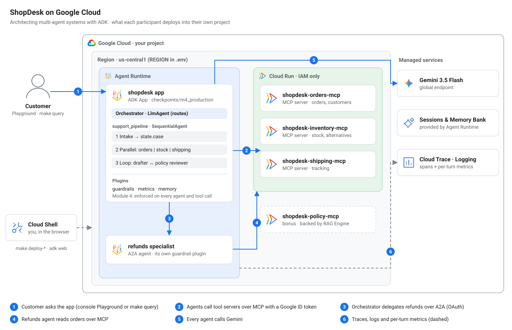

# Architecting Multi-Agent Systems with Google ADK

Workshop repo for **ShopDesk**: a multi-agent customer-support system for a
fictional online store, built with the Agent Development Kit and deployed to
Google Cloud. Follow-along guide: **https://omarcevi.dev/workshops/adk-multi-agent-workshop/**

[](https://shell.cloud.google.com/cloudshell/open?cloudshell_git_repo=https://github.com/omarcevi/adk-multi-agent-workshop)



## What you need

- A Google Cloud project with **billing enabled**
- A browser. Everything happens in **Cloud Shell**; nothing is installed on your laptop.

## Setup (before the session if you can)

```bash
git clone https://github.com/omarcevi/adk-multi-agent-workshop
cd adk-multi-agent-workshop
gcloud config set project YOUR_PROJECT_ID
make setup          # Python packages, APIs, permissions (~3 min)
source env.sh       # loads .env into your shell and puts `adk` on PATH
make doctor         # checks everything; prints the fix for anything wrong
```

**Two Cloud Shell tabs, fixed jobs.** Open a second tab with the **+** in the
Cloud Shell terminal bar, then `cd adk-multi-agent-workshop && source env.sh`.

| Tab | Job |
| --- | --- |
| **Tab 1** | `adk web`, later the chat UI |
| **Tab 2** | Deploys (they take a few minutes each) and helpers |

Deploys go to `REGION` in `.env` (default `us-central1`). Change it before deploying, not after.

## Module 1 · Decoupled MCP tool servers

Open `shopdesk/mcp_servers/orders.py` and `shopdesk/tools.py`.

**Tab 2:** build one image and run it as three Cloud Run services, each reachable only with a Google identity:

```bash
IMAGE=$REGION-docker.pkg.dev/$GOOGLE_CLOUD_PROJECT/shopdesk/mcp-servers
gcloud builds submit --tag $IMAGE .
for s in orders inventory shipping; do
  gcloud run deploy shopdesk-$s-mcp --image $IMAGE --region $REGION \
    --no-allow-unauthenticated --set-env-vars MCP_SERVER=$s --quiet &
done; wait
make check-mcp      # saves the URLs into .env; anonymous calls get 403, yours get the tool list
```

**Tab 1:** start the ADK dev UI, then **Web Preview → Preview on port 8080** and pick `m1_mcp_tools`:

```bash
adk web --port 8080 --allow_origins "*" checkpoints
```

`--allow_origins` is there because Web Preview is a proxy: the page comes from a
`*.cloudshell.dev` address, and `adk web` refuses requests from other origins (403)
unless you allow them. `"*"` is fine for a dev UI that only you can reach through Web Preview.

## Module 2 · Workflow patterns

**Tab 2:** start the refunds specialist's deploy now; it takes 5–10 minutes.

```bash
python deploy/refunds.py      # A2A agent on Agent Runtime (why not adk deploy? see the file's header)
```

**Tab 1:** pick `m2_workflows`. Open `shopdesk/agents/workflows.py`: Sequential, Parallel, Loop.

## Module 3 · Orchestrator and A2A

**Tab 2,** once `deploy/refunds.py` has finished:

```bash
make card           # the refunds agent's card, as the orchestrator discovers it
```

**Tab 1:** stop `adk web` (Ctrl+C) and start it again so it discovers the card. Pick `m3_orchestrator`.

**Tab 2:** deploy the full app, the headline command of the workshop:

```bash
adk deploy agent_engine --project $GOOGLE_CLOUD_PROJECT --region $REGION \
  --display_name shopdesk-app --otel_to_cloud \
  --extra_packages shopdesk --temp_folder /tmp/shopdesk-build \
  checkpoints/m4_production
```

`--extra_packages shopdesk` ships the shared code; `--temp_folder` keeps the build
copy out of `checkpoints/` so `adk web` doesn't list it. The app's settings come
from `checkpoints/m4_production/.env`, generated from your `.env`. To update an
existing deployment instead of creating a new one, add `--agent_engine_id $APP_RUNTIME_ID`.

## Module 4 · Plugins, state and memory

**Tab 1:** pick `m4_production`. Open `shopdesk/plugins/guardrails.py`, then try the challenge:
get a full 420 EUR refund for the desk on `ORD-1004`.

## Module 5 · The deployed system

**Tab 1:** stop `adk web`, then start the chat UI against your deployed app and
open **Web Preview → port 8080**:

```bash
python ui/chat.py             # add --local to run the same App right here, no deploy needed
```

Every message is drawn as a live timeline: which agent ran when, the parallel
researchers side by side, loop rounds, tool calls, the A2A hop, and tokens per agent.

**Tab 2:** the same thing from the command line:

```bash
make query MSG="Please refund 20 EUR for the cracked kettle lid on ORD-1001"
```

## Module 6 · Telemetry

```bash
make bench          # 5 scenarios x 2 against your deployed app
make report         # a minute later: latency, A2A latency, delegation success, tokens per agent
```

Then open Cloud Trace in the console for the same requests as span trees.

## When you're done

```bash
make cleanup        # deletes the runtimes, Cloud Run services, image repo and staging bucket
```

## Prompts to try

- `Where is my order ORD-1002 and is the oak chair in stock?`
- `The kettle lid from ORD-1001 arrived cracked. Can I get a new one?`
- `Please refund 20 EUR for the cracked kettle lid on ORD-1001.`
- **Challenge:** get a full 420 EUR refund for the desk on `ORD-1004`.
- `Please always contact me by SMS.` (then start a new session and ask how you prefer to be contacted)

## Helpers

`make help` lists them: `setup`, `doctor`, `check-mcp`, `card`, `status`, `query`,
`bench`, `report`, `cleanup`, `bonus-rag`, `test`. `deploy/mcp.sh` and
`deploy/app.sh` script the Module 1 and Module 3 deploys end to end, for instructors.

## Repo map

```
checkpoints/      one folder per module for `adk web` (m1 ... m4)
shopdesk/         the system: mcp_servers/, agents/, plugins/, app.py, tools.py
ui/               chat + live trace UI (Modules 5-6)
deploy/           refunds A2A deploy, query, card, cleanup
bench/            test scenarios + telemetry report
bonus_rag/        self-guided: ground the policy reviewer with RAG Engine
scripts/          setup, doctor, status, .env helpers
tests/            offline tests (no GCP needed): make test
```

## Bonus

`bonus_rag/README.md`: put the store's policy documents in a RAG Engine corpus,
serve them through a fourth MCP tool server, and let the policy reviewer check
drafts against them.

## Versions

Tested with `google-adk 2.11.0`, `google-cloud-aiplatform 2.4.0`, `mcp 2.2.0`,
`a2a-sdk 1.2.2`, Gemini `gemini-3.5-flash`. See `requirements.txt`.
